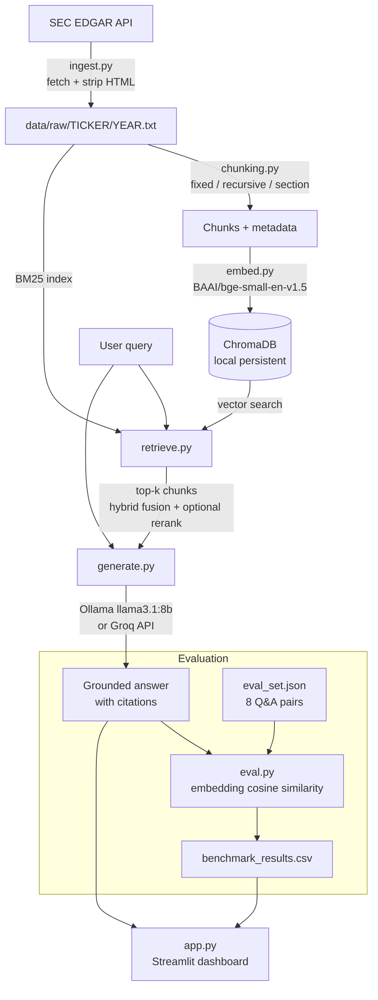
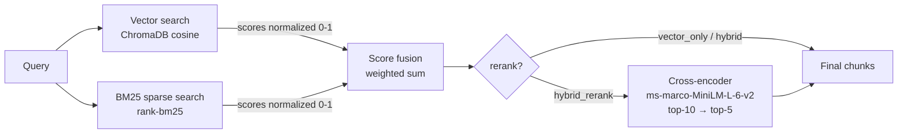

# FinSight

RAG system over SEC EDGAR 10-K filings. Ingests, chunks, embeds, retrieves, and generates grounded answers with numbered citations. Includes a benchmarking suite across 9 strategy combinations and a Streamlit dashboard.

**Companies:** AAPL, JPM, JNJ — fiscal years 2021–2023  
**Stack:** Ollama + sentence-transformers + ChromaDB (local); Groq supported for cloud deployment

---

## Architecture



---

## Retrieval Pipeline



---

## Project Structure

```
finsight/
│
├── src/
│   ├── ingest.py        # SEC EDGAR downloader — scans all filing pages,
│   │                    #   uses reportDate (not filingDate) for fiscal year matching
│   ├── chunking.py      # fixed-size / recursive / section-aware strategies
│   │                    #   section-aware splits on 10-K Item headers first
│   ├── embed.py         # EmbeddingIndex — ChromaDB + SentenceTransformer
│   │                    #   lazy model loading; shared client across instances
│   ├── retrieve.py      # HybridRetriever — strategy selected at query time
│   │                    #   BM25 built in-memory; cross-encoder loaded lazily
│   ├── generate.py      # grounded system prompt + numbered citations
│   │                    #   _chat() uses Groq if GROQ_API_KEY is set, else Ollama
│   ├── eval.py          # answer_similarity + context_relevance via cosine similarity
│   └── benchmark.py     # runs all 9 combinations, writes benchmark_results.csv
│
├── configs/
│   └── config.yaml      # models, chunk sizes, retrieval weights, company CIKs, paths
│
├── data/
│   ├── raw/             # plain-text 10-K filings (~6 MB, committed to git)
│   │   ├── AAPL/        #   2021.txt, 2022.txt, 2023.txt
│   │   ├── JPM/
│   │   └── JNJ/
│   ├── eval_set.json    # 8 ground-truth Q&A pairs
│   └── chroma/          # ChromaDB vector store (~180 MB, gitignored)
│
├── .github/
│   └── workflows/
│       └── ci.yml       # lint (ruff) + import check on push
│
├── .streamlit/
│   └── secrets.toml.example
│
└── app.py               # Streamlit dashboard — Chat / Year-over-Year Diff / Benchmark tabs
```

---

## Benchmark Results

Metrics: `answer_similarity` = cosine(embed(answer), embed(ground\_truth)); `context_relevance` = cosine(embed(query), embed(top chunk)). Eval set: 8 Q&A pairs, AAPL + JNJ, 2021–2023.

| Chunking   | Retrieval       | Answer Similarity | Context Relevance | Latency (s) |
|------------|-----------------|:-----------------:|:-----------------:|:-----------:|
| recursive  | vector\_only    | **0.847**         | 0.788             | 14.0        |
| recursive  | hybrid          | 0.841             | 0.763             | **12.7**    |
| section    | vector\_only    | 0.845             | 0.787             | 15.7        |
| fixed      | vector\_only    | 0.842             | **0.788**         | 13.4        |
| fixed      | hybrid          | 0.834             | 0.783             | 12.9        |
| section    | hybrid          | 0.833             | 0.778             | 14.1        |
| fixed      | hybrid\_rerank  | 0.793             | 0.766             | 14.8        |
| recursive  | hybrid\_rerank  | 0.793             | 0.773             | 17.0        |
| section    | hybrid\_rerank  | 0.777             | 0.767             | 13.7        |

---

## Run Locally

**Prerequisites:** Python 3.9+, [Ollama](https://ollama.com) with `llama3.1:8b-instruct-q4_0` pulled

```bash
# 1. create and activate virtual environment
python -m venv finsight
finsight\Scripts\activate        # Windows
# source finsight/bin/activate   # macOS / Linux

# 2. install dependencies
pip install -r requirements.txt

# 3. download 10-K filings from SEC EDGAR
python src/ingest.py

# 4. build ChromaDB indexes (~10 min)
python src/embed.py

# 5. start Ollama in a separate terminal
ollama serve

# 6. run the benchmark (optional, ~30–60 min)
python src/benchmark.py

# 7. launch the dashboard
streamlit run app.py
```

---

## Deploy to Streamlit Community Cloud

Set `GROQ_API_KEY` and the app uses Groq instead of Ollama. No code changes needed.

| `GROQ_API_KEY` set? | LLM |
|---|---|
| Yes | Groq `llama-3.1-8b-instant` |
| No | Local Ollama |

1. Push to GitHub (`data/raw/` is committed; `data/chroma/` is gitignored)
2. Connect the repo at [share.streamlit.io](https://share.streamlit.io)
3. Under **App Settings → Secrets**:
   ```toml
   GROQ_API_KEY = "your_key_here"
   ```
   Free key at [console.groq.com](https://console.groq.com)
4. Deploy — indexes rebuild from `data/raw/` on first cold start (~10 min)

---

## CI

GitHub Actions on push / PR to `main`: lint with `ruff`, import check for all modules.  
See [`.github/workflows/ci.yml`](.github/workflows/ci.yml).
